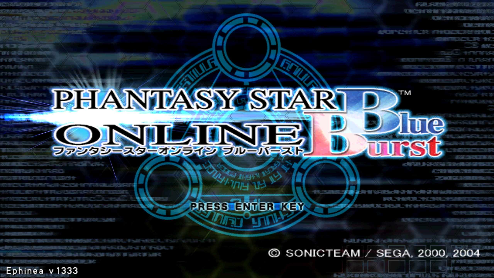
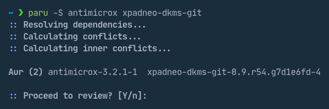
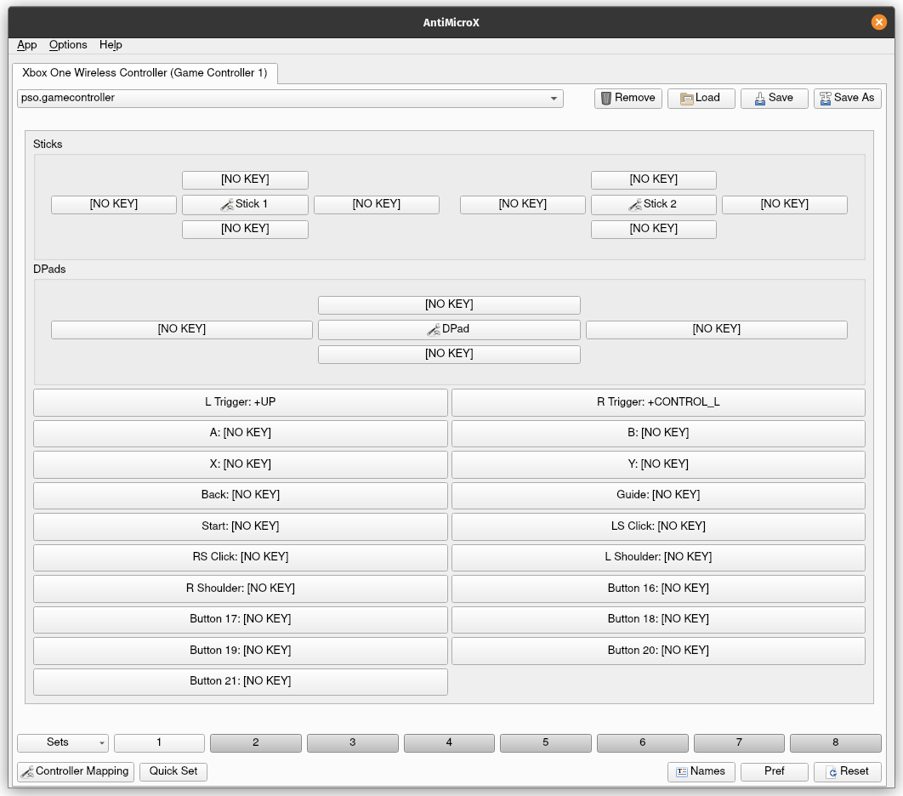
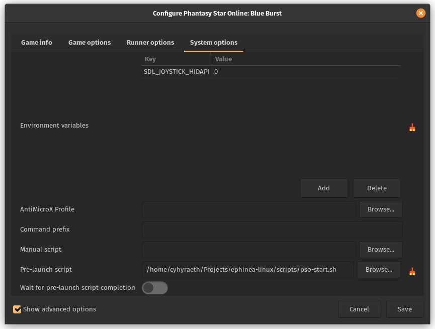
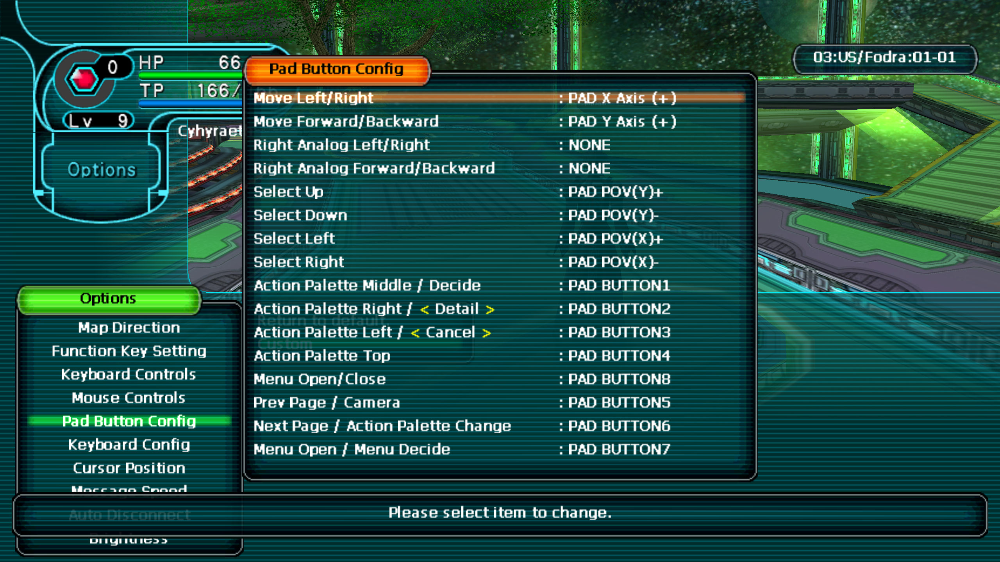

# Phantasy Star Online: Blue Burst

### Tutorial for playing Phantasy Star Online: Blue Burst on Linux

# Instructions

## Initial Setup

- install using the `EphineaPSO version` of the
  [Lutris](https://lutris.net/games/phantasy-star-online-blue-burst/)
  install script

- change wine version to `System (7.0 (Staging))`
  to prevent black screen on character creation

- enable fullscreen by disabling window mode and setting
  resolution to the native resolution of your monitor

## Xbox One Wireless Controller

- install [AntiMicroX](https://github.com/AntiMicroX/antimicrox) and
  [xpadneo](https://github.com/atar-axis/xpadneo) (available as the `antimicrox`  
  and `xpadneo-dkms-git` packages in the Arch User Repository  
  for users of Arch-based Linux distributions)

- copy the `antimicrox/pso.gamecontroller.amgp` file to  
  `$HOME/.local/share/antimicrox/pso.gamecontroller.amgp`

  or configure AntiMicroX manually based on the included image  
  (L Trigger assigned to UP, R Trigger assigned to CONTROL_L)  
  and save the controller profile to  
  `$HOME/.local/share/antimicrox/pso.gamecontroller.amgp`

- add the `SDL_JOYSTICK_HIDAPI=0` environmental variable and pre-launch script  
  to the game configuration under `System options` in Lutris (make sure to tick  
  the `Show advanced options` checkbox in the bottom left corner)

- configure controller buttons using in-game settings

## Connecting Bluetooth Controller

- follow
  [these instructions](https://github.com/atar-axis/xpadneo#connection)
  for connecting  
  manually using the command line

  OR

- install `expect` (available in the Arch Linux official repositories)

- run the `bluetooth.sh` script, passing it the  
  bluetooth address as its only argument, e.g.  
  `./scripts/bluetooth.sh 00:11:22:33:FF:EE`

# Troubleshooting

## Controls Not Working

If controls do not work properly after lanching the game,  
try clicking the mouse anywhere in the game window

# Lutris

## Banner

To use this banner instead of the default one added by  
the Lutris installer, replace the image file located in  
`$HOME/.local/share/banners/phantasy-star-online-blue-burst.jpg`  
with the image file in the banner directory of this repository.
