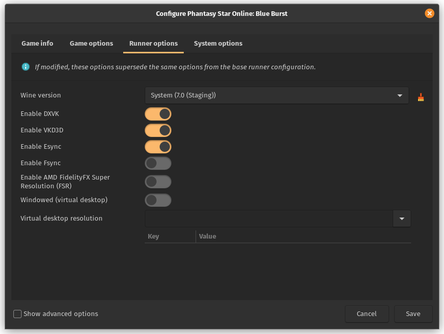

## Phantasy Star Online: Blue Burst

Tutorial for playing Phantasy Star Online: Blue Burst on Linux

## Instructions

### Initial Setup

- install using the `EphineaPSO version` of the
  [Lutris](https://lutris.net/games/phantasy-star-online-blue-burst/)
  install script

- change wine version to `System (7.0 (Staging))`
  to prevent black screen on character creation

- enable fullscreen by disabling window mode and setting
  resolution to the native resolution of your monitor

### Xbox One Wireless Controller

- add the `SDL_JOYSTICK_HIDAPI=0` environmental variable (see image)

- install `antimicrox` and `xpadneo-dkms-git` (available in AUR)

- copy the `antimicrox/pso.gamecontroller.amgp` file to  
  `$HOME/.local/share/antimicrox/pso.gamecontroller.amgp`

- or configure AntiMicroX manually based on the included image  
  (L Trigger assigned to UP, R Trigger assigned to CONTROL_L)  
  and save the controller profile to  
  `$HOME/.local/share/antimicrox/pso.gamecontroller.amgp`

- add pre-launch script to game configuration in Lutris

- configure controller buttons using in-game settings

### Connecting Controller

- install `expect` (available in official repos)

- run the `bluetooth.sh` script, passing it the  
  bluetooth address as its only argument, e.g.  
  `./scripts/bluetooth.sh 00:11:22:33:FF:EE`

## Troubleshooting

### Keyboard Not Working

If keyboard is not responding after lanching the game,  
try clicking the mouse anywhere in the game window

## Lutris

### Banner

To use this banner instead of the default one added by  
the Lutris installer, replace the image file located in  
`$HOME/.local/share/banners/phantasy-star-online-blue-burst.jpg`  
with the image file in the banner directory of this repository.
